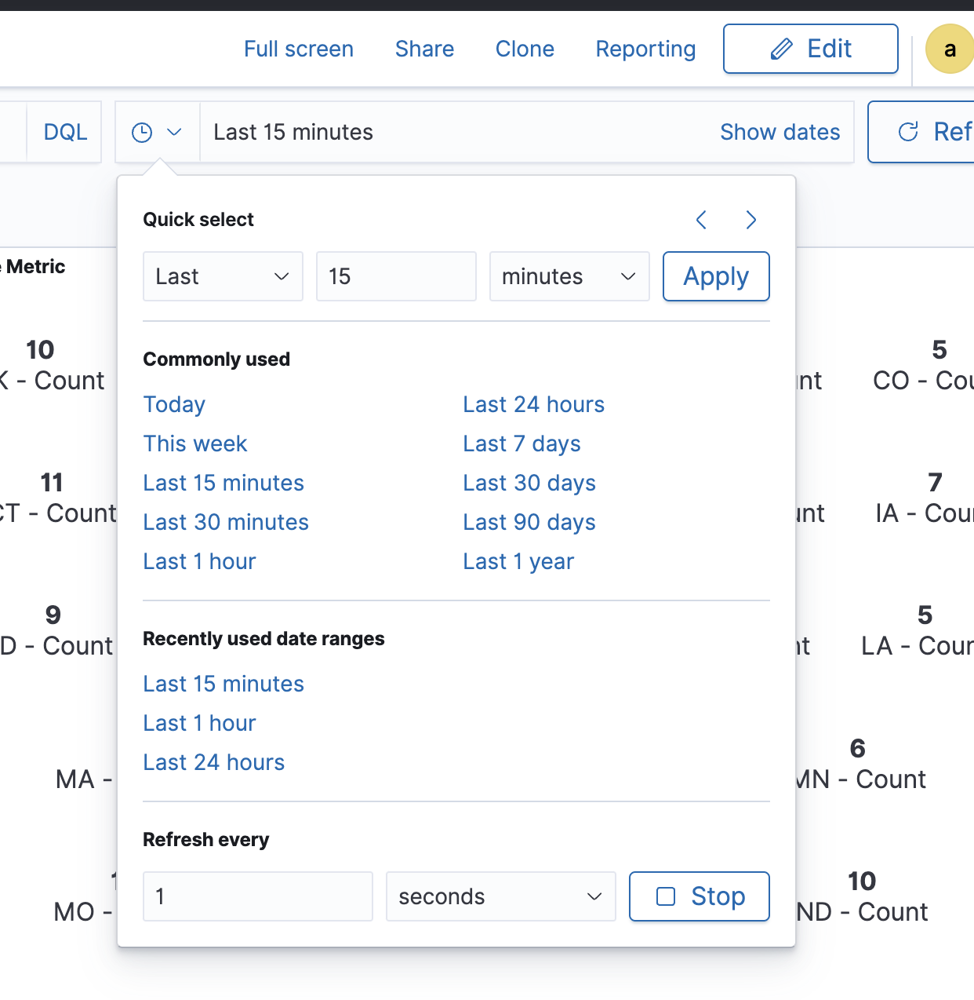
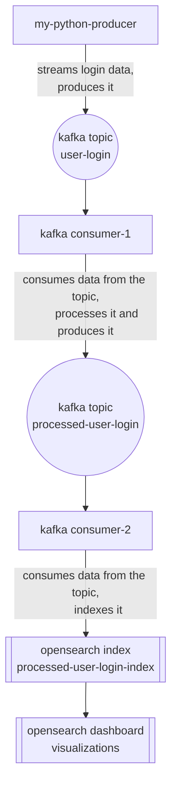

# real-time-data-processing-analytics

Fetch Data Ops / Data Engineer Take Home Exercise - Real Time Data Processing and Analytics using Kafka, Docker, Python and OpenSearch


## Demo


## Requirements

### Tools

- [Kafka](https://www.confluent.io/)
- [Docker](https://www.docker.com/)
- [Docker Compose](https://docs.docker.com/compose/)
- [Python](https://www.python.org/)
- [OpenSearch](https://opensearch.org/)

## Libraries

- [`confluent-kafka`](https://pypi.org/project/confluent-kafka/)
- [`kafka-python`](https://pypi.org/project/kafka-python/)
- [`openseach-py`](https://pypi.org/project/opensearch-py/)

## Setup

Clone the repository

```bash
$ git clone https://github.com/jyok117/real-time-data-processing-analytics
$ cd real-time-data-processing-analytics
```

Start the services

The services include Kafka, Zookeeper, OpenSearch, OpenSearch Dashboards, `my-python-producer` and `my-consumer`

```bash
$ docker-compose up --build
```

The `my-python-producer` generates random user login data and sends it to the Kafka topic `user-login`.

Check if the Kafka is receiving the data from the `my-python-producer`.

```bash
$ KAFKA_CONTAINER=$(docker ps --filter "name=kafka" --format "{{.ID}}")
$ docker exec -it $KAFKA_CONTAINER kafka-console-consumer --bootstrap-server localhost:9092 --topic user-login --group my-app
```

If there is no group associated with the consumer, you can create the group by running the above command.

The [`consumer-1`](./src/consumer-1.py) consumes messages from the Kafka topic `user-login`, processes the messages, and sends the processed messages to the Kafka topic `processed-user-login`. The [`consumer-2`](./src/consumer-2.py) then consumes messages from the Kafka topic `processed-user-login`, indexes the messages to an OpenSearch index `processed-user-login-index`.

The credentials for the OpenSearch and OpenSearch Dashboards are `admin:admin`.

The OpenSearch Dashboards can be accessed at `http://localhost:5601`. You can import the dashboard from the [`dashboard.ndjson`](./assets/dashboard.ndjson) file.

```
OpenSearch Dashboard -> Management -> Stack Management -> Saved Objects -> Import -> Select dashboard.ndjson file -> Import
```

This will create the dashboard with visualizations and the required index patterns.

```
OpenSearch Dashboard -> Dashboard -> Real-Time Data Processing and Analytics
```

Set the time range to `Last 15 minutes` and refresh time to `Every 1 second` to see the real-time data.



## Workflow



## Producer

The producer is a Python script that generates random user login data and sends it to the Kafka topic `user-login`.

### Sample Message

From `my-python-producer`

```json
{
  "user_id": "a6397988-1649-4859-ae5f-a1407b638ca6",
  "app_version": "2.3.0",
  "ip": "108.228.145.239",
  "locale": "RI",
  "device_id": "6221eb3d-89b5-4585-8c98-545b78e24c53",
  "timestamp": 1720576825,
  "device_type": "iOS"
}
```

## Consumer

The consumer-1 is a Python script that reads messages from the Kafka topic `user-login`, processes the messages, and sends the processed messages to the Kafka topic `processed-user-login`.

The consumer-2 is a Python script that reads messages from the Kafka topic `processed-user-login`, indexes the messages to an OpenSearch index `processed-user-login-index`.

```bash
$ python -m venv .venv
$ source .venv/bin/activate
(.venv) $ cd src/
(.venv) $ pip install -r requirements.txt
(.venv) $ python consumer-1.py &
(.venv) $ python consumer-2.py &
```

## Useful Commands

```bash
# Start the services
$ docker-compose up

# Get the details of the running containers
$ docker ps -a

# Consuming messages from the Kafka Topic
$ docker exec -it <kafka> kafka-console-consumer --bootstrap-server localhost:9092 --topic user-login --group my-app

# Get the group id of the Kafka Consumer
$ docker exec -it <kafka> kafka-consumer-groups --bootstrap-server localhost:9092 --list

# List the topics in the Kafka Cluster
$ docker exec -it <kafka> kafka-topics --bootstrap-server localhost:9092 --list
```
